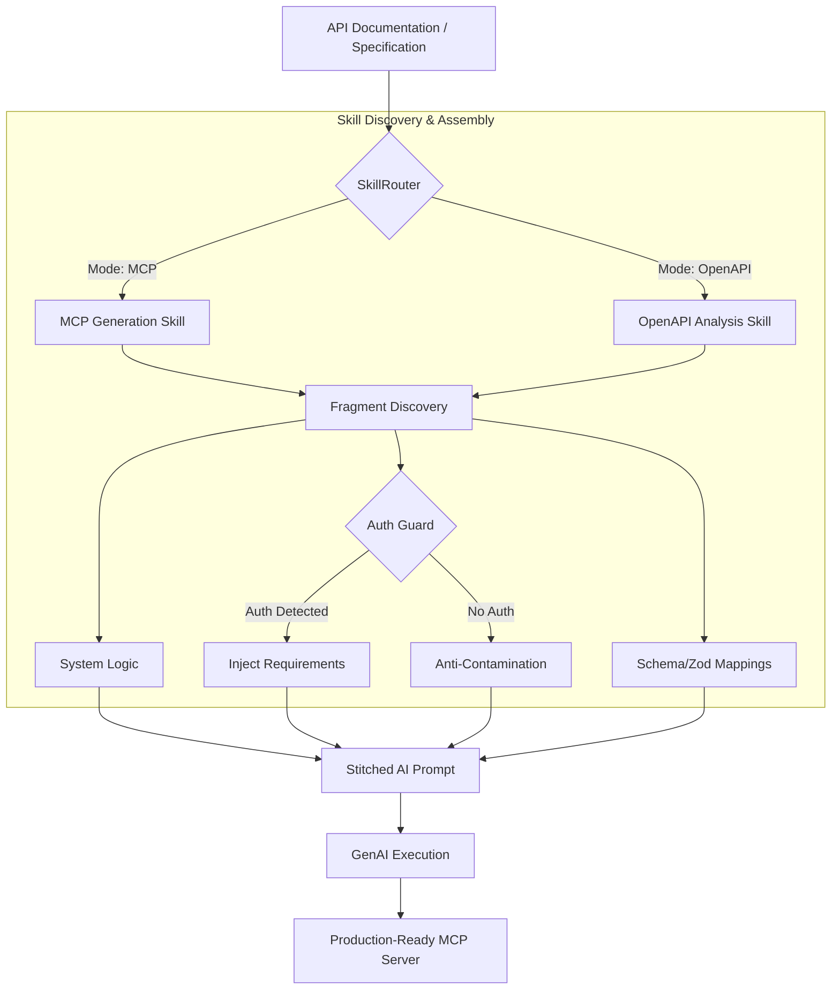

## 🤖 Intelligent API-to-MCP Translator

This project focuses on building an AI-driven system that automatically translates RESTful API definitions into a format compatible with MCP Servers. The generated MCP modules are designed for seamless integration with platforms like Claude and other LLM-based environments, enabling scalable deployment and enhanced interoperability for AI applications.

## 🏗️ Architecture: Hybrid Agent Skill System

The platform utilizes a **Hybrid Agent Skill System** to achieve high-precision code generation. Instead of using a single monolithic prompt, the engine dynamically assembles specialized "skills" based on the input context.

### 🔄 System Flow



### 🧠 Core Components

#### 🛠️ Modular Skill Pipeline (`src/skills/`)

All prompt logic is decomposed into reusable Markdown fragments. This allows for:

- **Zero Knowledge Contamination**: Anti-contamination guards prevent the model from "hallucinating" auth parameters into public APIs.
- **Context Optimization**: Dynamically trimming examples and instructions to fit within token limits (managed via `utils/token-counter.ts`).
- **High Consistency**: Common patterns (like Zod mappings and HTTP request structures) are shared across all generations.

#### 🔐 Intelligent Auth Guard

The system automatically scans input specifications for security schemes (OAuth2, Bearer, Basic Auth, API Keys).

- If **Auth is detected**: The generator injects specialized handlers and parameter injection logic.
- If **No Auth is found**: The system applies strict isolation prompts to ensure no security vulnerabilities are accidentally introduced.

#### 🧩 Skill Directory Structure

```text
src/skills/
├── auth/           # Security & authentication logic fragments
├── mcp/            # MCP server architecture & transport patterns
├── openapi/        # OpenAPI spec analysis & YAML generation
└── skill-router.ts # The brain that assembles context-aware prompts
```

---

## 🧠 Dynamic Skill Selection

Phase 4 adds a production-ready dynamic skill selection layer in [`src/skill-intelligence/agent.ts`](src/skill-intelligence/agent.ts). When enabled, the generator profiles each API spec, scores the skill registry, assembles only relevant prompt fragments, and records lightweight metrics for rollout monitoring.

### Configuration

Add these optional settings to [`.env`](.env):

```bash
# Enable dynamic skill selection. Leave unset or false to use the static prompt path.
DYNAMIC_SKILL_SELECTION=true

# Force a rollout variant: control, dynamic, or hybrid.
# Use any other value to enable deterministic hash-based traffic allocation.
SKILL_SELECTION_VARIANT=dynamic

# Used only when SKILL_SELECTION_VARIANT is not control/dynamic/hybrid.
SKILL_SELECTION_CONTROL_TRAFFIC=0.1
SKILL_SELECTION_DYNAMIC_TRAFFIC=0.45
SKILL_SELECTION_HYBRID_TRAFFIC=0.45

# Hybrid mode falls back to the static prompt when confidence is below this value.
SKILL_SELECTION_HYBRID_CONFIDENCE_THRESHOLD=0.7
```

### Rollout variants

- **`control`**: uses the existing static prompt path.
- **`dynamic`**: uses [`SkillSelectionAgent`](src/skill-intelligence/agent.ts) for spec profiling, skill scoring, and prompt assembly.
- **`hybrid`**: uses dynamic selection only when confidence is high enough; otherwise it falls back to the static prompt.

### Monitoring and safety

The dynamic layer emits [`console.log()`](src/skill-intelligence/agent.ts:121) and [`console.warn()`](src/skill-intelligence/composer.ts:111) events with operational signals such as initialization duration, spec analysis duration, cache hit rate, selected skill count, and selection confidence. The composer also enforces a hard token ceiling and uses safe fallback skills when average confidence is too low.

A lightweight skill health dashboard is available through [`src/skill-intelligence/cli.ts`](src/skill-intelligence/cli.ts):

```bash
npx tsx src/skill-intelligence/cli.ts dashboard
```

### Validation

Run the Phase 4 checks with:

```bash
npm run typecheck
npm run test:phase4
```

---

## 🚀 Quick Start

### AI Provider Configuration

mcp-gen supports multiple AI providers via LangChain:

1. **Google Gemini** (default): Fast, cost-effective for code generation
2. **Groq**: High-performance inference with Llama models
3. **MetaClaw** (recommended): Anthropic Claude via MetaClaw proxy with skill injection and continuous learning

#### Using MetaClaw (Recommended for Production)

MetaClaw acts as an intelligent proxy that injects relevant skills and accumulates knowledge across generations:

1. Install and start MetaClaw on your host machine:

   ```bash
   pip install -e ".[evolve]"
   metaclaw setup  # Follow wizard to configure
   metaclaw start --mode skills_only --port 30000
   ```

2. Configure mcp-gen to use MetaClaw by editing `.env`:

   ```bash
   METACLAW_ENABLED=true
   METACLAW_BASE_URL=http://host.docker.internal:30000/v1
   METACLAW_API_KEY=metaclaw
   ```

3. Keep your existing Gemini/Groq API keys as fallback (used only if MetaClaw is disabled).

**Benefits:**

- Skill injection: MetaClaw searches `~/.metaclaw/skills/` for relevant patterns
- Continuous improvement: MetaClaw learns from successful generations
- Consistent quality: Best practices are automatically applied

**Note:** When using Docker Compose, ensure MetaClaw is accessible from containers via `host.docker.internal` (macOS/Windows) or host IP on Linux.

### Installation Steps

1. Clone this project:

   ```bash
   git clone <your-repo>
   cd mcp-gen
   ```

2. Create an environment file:

   ```bash
   cp .env.example .env
   ```

   Configure your AI provider(s). **Recommended: Use MetaClaw for best results:**

   ```bash
   # MetaClaw (recommended) - provides skill injection and continuous learning
   METACLAW_ENABLED=true
   METACLAW_BASE_URL=http://localhost:30000/v1
   METACLAW_API_KEY=metaclaw

   # Keep Gemini or Groq as fallback (only used if MetaClaw is disabled)
   GEMINI_API_KEY=your_gemini_api_key
   GEMINI_MODEL=gemini-2.5-flash
   # or
   GROQ_API_KEY=your_groq_api_key
   GROQ_MODEL=llama-3.3-70b-versatile
   ```

   Other required settings:

   ```bash
   # Docker network for generated MCP servers
   MCP_NETWORK=mcp-network

   # Base Docker image for generated MCP servers (build this in next step)
   DEFAULT_MCP_IMAGE=mcp-gen
   ```

3. **Build the base MCP server image (Important!):**

   ```bash
   docker build -t mcp-gen .
   ```

   This creates a reusable image that all MCP server containers will use. Building this once saves time (~20-30s per request) and disk space.

4. Build Docker Compose services:

   ```bash
   docker-compose build
   ```

5. Start all services:

   ```bash
   docker-compose up -d
   ```

   Services will start on:
   - API Manager: `http://localhost:8080`
   - Proxy: `http://localhost:8081`
   - MongoDB: `localhost:27017`
   - RabbitMQ: `localhost:5672` (management UI: `http://localhost:15672`)

6. Create an MCP server from an API specification using cURL:

   ```bash
   curl -X POST http://localhost:8080/api/mcp/create \
     -H "Content-Type: application/json" \
     -d '{
       "request": "Your API documentation or specification here...\n\nExample:\nGET /api/users - Get list of users\nPOST /api/users - Create new user\nGET /api/users/{id} - Get user by ID",
       "userId": "user123",
       "email": "user@example.com"
     }'
   ```

   **Required fields:**
   - `request`: API documentation/specification
   - `userId`: Unique user identifier
   - `email`: User email address
   - `name`: Name for the MCP server (optional)

   **Optional fields:**
   - `dockerImage`: Custom Docker image name (defaults to `mcp-gen` from env variable `DEFAULT_MCP_IMAGE`)

   **Response example:**

   ```json
   {
     "status": "success",
     "serverId": "mcp-server-abc123",
     "config": {
       "mcpServers": {
         "my-api-mcp": {
           "command": "npx",
           "args": [
             "mcp-remote",
             "http://your-domain.com:8080/mcp/mcp-server-abc123?token=jwt_token_here",
             "--allow-http"
           ]
         }
       }
     }
   }
   ```

7. The generated MCP server is now ready to use with Claude or other LLM platforms. Copy the configuration to your Claude settings.
